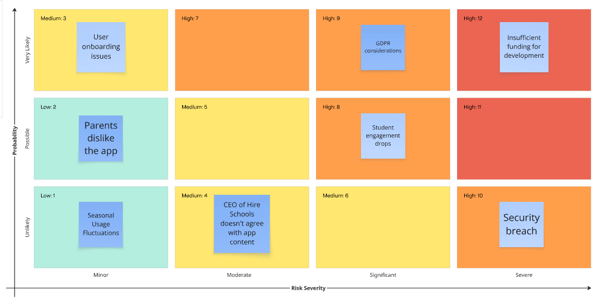

# Syntax Schoolers: VivaLingo


### As part of Week 5's project, we were tasked with designing and developing an educational game to address a real-world challenge faced by schools.

Our team created VivaLingo: a French language learning app aimed at secondary school students. It was developed in response to a brief from the Hive Foundation, which highlighted a decline in student engagement with non-STEM subjects, particularly languages.

VivaLingo was built to be:

- Fun and repeatable, using gamified sentence and vocabulary activities

- User-focused, particularly for students and teachers

- Minimal but functional, as an MVP ready for testing and iteration

We followed Agile methodologies, applied UX design principles, and built a full-stack solution using the MVC architecture.

## Problem Statement
The Hive Foundation identified that students are increasingly disengaged from non-STEM subjects due to a heavy curriculum focus on STEM, repetitive lesson formats, and overwhelming content. This has led to:

- Reduced classroom enjoyment

- Superficial knowledge retention

- Declining interest in subjects like languages and geography

The goal of our project was to **design a language-learning tool that places student enjoyment at the centre** while also supporting teachers and aligning with national curriculum objectives.

## Core Features

- Gamified French learning experience
- Progress tracking and analytics
- Separate dashboards for students and staff
- Three progressive difficulty levels
- Secure user authentication


## Installation and Usage
1. Clone the repo

    ``` https://github.com/katelynlai/SyntaxSchoolers.git```

2. Backend setup
    - Navigate to ```/backend```
    - Install dependencies using ```npm install```
    - Set up your ```.env``` file 
    ``` 
        PORT=3000
        DB_URL=<your-link-here>
        BCRYPT_SALT_ROUNDS=10
        SECRET_TOKEN=<your secret token>
     ```
    - Set up your database with ```npm run setup-db```
    - Start the server using ```npm run dev```
    - Visit ```http://localhost:3000``` in your browser

3. Usage
    - Sign up or log in
    - Begin at level 1 and work your way up!
    - Track your progress over time
  
## Current Bugs

#### Restarting progress

- On completion of the game, to restart your progress you must go into your database and manually delete all entries in the levelprogress and overallprogress tables. 

    To fix this:
    
    Go through all HTTP requests and ensure that the userID is being imported from the database. Look out for where userID is hardcoded as 1.

    TIP! Check the frontend js files and the backend controller folder.

#### Authentication 

- Currently the JWT token is not being handed correctly to the user upon log-in. 
- Additionally each page can be accessed without logging in.

    To fix this: 
    
    Check through the "user" MVC pathway to add client side authentication and secure the pages via the frontend JS files

## Technologies

- Frontend: HTML, CSS, JavaScript, Jest

- Backend: Node.js, Express

- Database: SQL, Supabase

- Tools: Git, GitHub, Trello, Mermaid.js (ERD Visualisation), Figma

## Process
- Planning: Used Trello to break down features and track progress 

- Design: Created wireframes and user flow diagrams 


- Development: Applied MVC architecture, implemented authentication, developed API endpoints, connected frontend with backend

- Testing: Wrote Jest and Cypress tests for both frontend and backend to ensure >60% coverage

- Deployment: Deployed using Render for a seamless full-stack hosting solution

## Stakeholder Analysis

Here are some examples of stakeholder stories from those who would have an interest in the app.
- As a student, I want a fun, simple language learning app that makes learning engaging, repeatable, and memory-friendly without overwhelming content or textbooks.

- As a teacher, I want an app that helps my students retain key phrases through repetition and increasing challenges, keeping learning enjoyable and balancing STEM-heavy focus with language skills.

- As a product owner, I want to manage the development of a simple, fun language app for teenagers that stands out from content-heavy competitors, delivered on time and well-received in Beta.

- As a CEO of the Hive Schools, I want my pupils to embrace a holistic education including languages and critical thinking, not just STEM, supported by this app.

- As an Education Policy Advisor, I want students to engage with a language learning app that supports meeting national curriculum targets (e.g., Key Stages 2 and 3).

- As a marketing manager, I want young people to enjoy and benefit from the app so I can effectively promote its success.

- As a parent, I want my child to enjoy learning foreign languages without being overwhelmed, ensuring a well-rounded education beyond STEM subjects.

- As a software developer, I want to build an intuitive, enjoyable app with a clean MVC-based codebase, providing an easy-to-navigate experience that motivates students.

A visualisation of the importance of each stakeholder can be viewed below in this stakeholder analysis diagram: 


## Risk Analysis

Here are some examples of risks analysis for the project.



## Entity Relationship Diagram (ERD)

The database structure for this application is illustrated below using an ERD generated with Mermaid.js. 

It reflects the core relationships between users, levels, vocabulary, sentence exercises, and progress tracking within the application.


## Development Wins and Challenges
Wins:

- Successfully implemented a fully functional MVP with user authentication

- Designed an intuitive, kid-friendly UI

- Built a scalable database schema supporting categories, levels, and progress tracking

Challenges:

- Balancing simplicity with meaningful language learning content

- Integrating backend and frontend seamlessly under time constraints

- Ensuring test coverage while meeting deployment deadlines