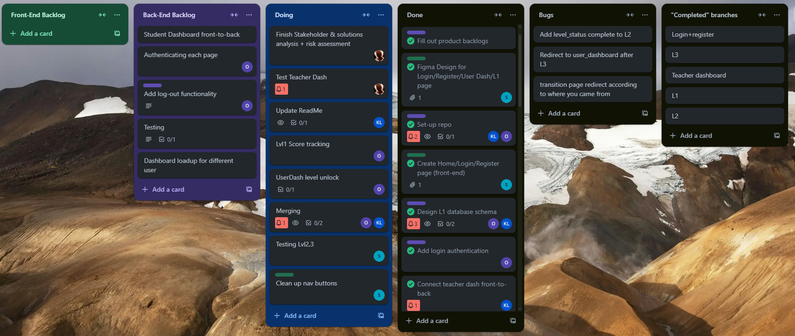

# Syntax Schoolers: Project Alpha

### For our full-stack project which consolidates all the technical skills that we have learnt in the last four weeks at La Fosse, we have created an MVP (Minimum Viable Product) called VivaLingo - an educational app that allows schoolchildren to learn French.

The aim of the app is to provide fun and engaging way of learning a non-STEM subject. The app allows for the translating of basic concepts between English and French. 

## Stakeholder & Solutions Analysis

Here are some examples of stakeholder stories from those who would have an interest in the app.
- [ ] As a student, I want a fun, simple language learning app, so that learning a language can be an engaging, repeatable, and memory-friendly experience, without being bombarded with overwhelming amounts of content and textbooks. 
- [ ] As a teacher, I want a simple language learning app for my students to use, so that they can retain key phrases through repetition with increasing challenges, while not getting bored or feeling like learning a foreign language is a chore. This app should provide a respite from facing lots of focus on STEM subjects, to the detriment of a greater knowledge of subjects such as languages and geography.
- [ ] As a product owner, I want to manage the production lifecycle of a simple, fun language learning app for teenagers, so that an alternative is available when compared to other apps that contain an overwhelming amount of content and visuals. I want to ensure that the production lifecycle is delivered on time, and that it receives positive feedback in the Beta phase.
- [ ] As a CEO of the Hive Schools, I want to see my pupils embrace a holistic education that includes retaining key knowledge and critical thinking so that they have a well-rounded education that isn't just focused on STEM subjects. I would hope that this app can achieve that.
- [ ] As a Government Department for Education policy advisor, I want to see students in schools engage in a language learning app that they can enjoy using, so that they can build on their foreign languages skills to reach targets such as key stages 2 and 3 under the national curriculum.
- [ ] As a marketing manager, I want to to see young people enjoy using our app, and find it effective in building on their language skills, so that I can spread the word on the effectiveness of the app in our marketing campaigns.
- [ ] As a parent, I want to see my son/daughter enjoy their education and have fun learning foreign languages while not being overwhelmed with content, so that they can have a well-rounded education that isn't just about technical knowledge in STEM subjects. 
- [ ] As a software developer, I want to build a language learning app that offers an enjoyable, intuitive UX experience for students, with a well-structured codebase built around MVC architecture, so that students can enjoy using my app to learn a foreign language, rather than it feeling like a chore. The ease of navigating the app should be important, bearing in mind the target audience.

A visualisation of the importance of each stakeholder can be viewed in this stakeholder analysis diagram. The teacher and student remain the most fundamentally importance in utilising the app accordingly.

## Risk Analysis

Here are some examples of risks and market analysis to the project.

## Entity Relationship Diagram (ERD)

The database structure for this app can be visualised as follows. This ERD was created with Mermaid.js.

## Project Management

We used Trello to structure our work in terms of tasks completed. 

## Technical Architecture

User Interface: HTML, CSS, JavaScript, Jest
Backend Services: Node, Express
Data Storage: SQL, Supabase
Data Schema visualisation: Mermaid
Infrastructure: Git

## Development Challenges

