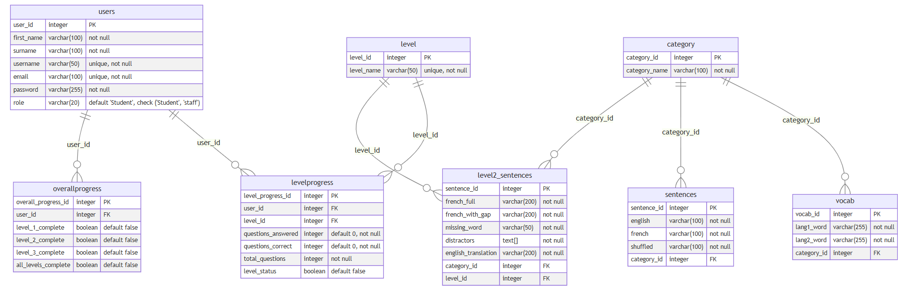

# Syntax Schoolers

### For our full-stack project which consolidates all the technical skills that we have learnt in the last four weeks at La Fosse, we have created an MVP (Minimum Viable Product) called VivaLingo - an educational app that allows schoolchildren to learn French.

The aim of the app is to provide fun and engaging way of learning a non-STEM subject. The app allows for the translating of basic concepts between English and French. 

## Stakeholder & Solutions Analysis

- [ ] As a student, I want a fun, simple language learning app, so that learning a language can be an engaging, repeatable, and memory-friendly experience, without being bombarded with overwhelming amounts of content and textbooks. 
- [ ] As a teacher, I want a simple language learning app for my students to use, so that they can retain key phrases through repetition with increasing challenges, while not getting bored. This app should provide a respite from facing lots of content in non-STEM subjects like languages or geography.
- [ ] As a product owner, I want a simple, fun language learning app for teenagers, so that an alternative is available when compared to other apps that contain an overwhelming amount of content and visuals.
- [ ] As a CEO of the Hive Schools, I want to see my pupils embrace a holistic education that includes retaining key knowledge and critical thinking so that they have a well-rounded education that isn't just focused on STEM subjects. I would hope that this app can achieve that.
- [ ] As a Government Body, 
- [ ] As a marketing manager
- [ ] As a parent,
- [ ] As a software developer

A visualisation of the importance of each stakeholder can be viewed in this stakeholder analysis diagram. The teacher and student remain the most fundamentally importance in utilising the app accordingly.

## Risk Analysis

## Entity Relationship Diagram (ERD)

The database structure for this app can be visualised as follows. This ERD was created with Mermaid.js.

